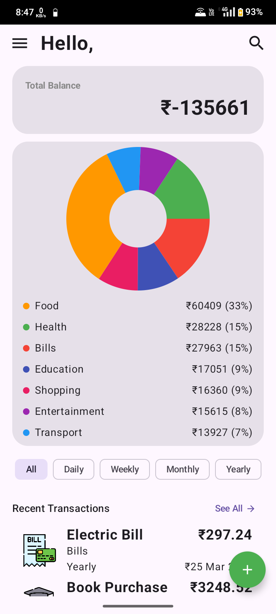
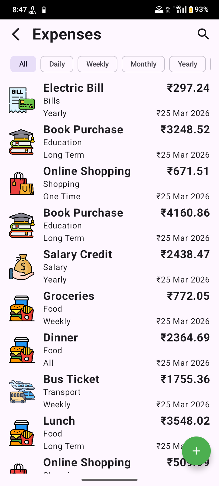
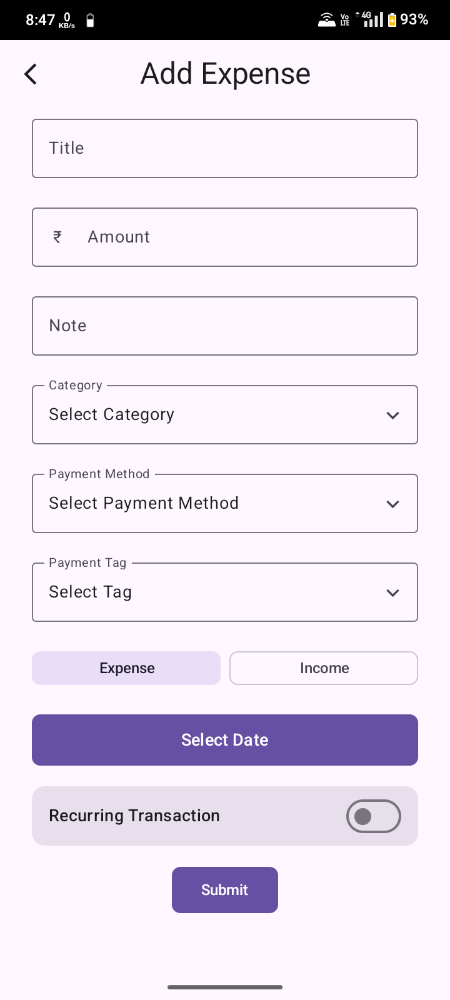
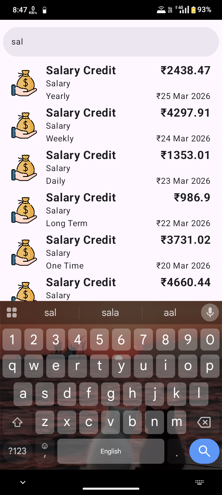
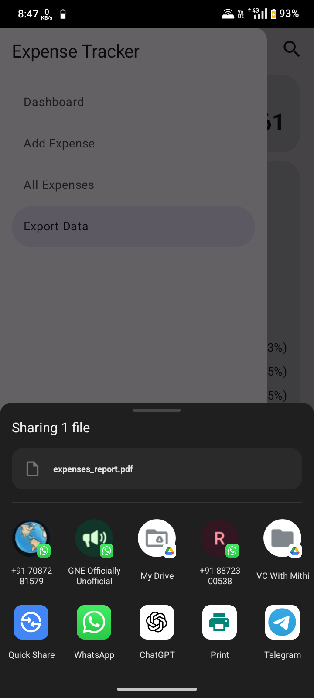

# 💰 Expense Tracker App


A modern **Expense Tracker Android App** built as a learning project to manage daily expenses efficiently with powerful features like analytics, filtering, and offline storage.

> 📊 Helps users track, analyze, and manage daily expenses with visual insights and offline reliability.

---

## 🎓 About This Project

This project was developed as part of my Android development journey.  
It showcases practical implementation of **Room Database, MVVM architecture, and advanced UI features**.

> ⚠️ This project is no longer actively maintained and serves as a learning/demo project.

---

## 🚀 Features

- 📊 **Dashboard with Pie Chart**
  - Visual representation of expenses by category

- ➕ **Add Expense**
- 🗑️ **Delete Expense**
- ✏️ **Edit Expense (Swipe Actions)**
  - Swipe to edit or delete entries easily

- 🔍 **Search Functionality**
  - Quickly find specific expenses

- 🏷️ **Category-wise Filters**
  - Filter expenses based on categories
  
- 📄 **Export & Share as PDF**
  - Generate expense report in PDF format
  - Opens Android share intent to share the PDF directly

- 💾 **Fully Offline**
  - No internet required
  - Data stored locally using Room Database

---

## 🛠️ Tech Stack

- **Language:** Kotlin / Java  
- **UI:** Jetpack Compose / XML  
- **Architecture:** MVVM  
- **Database:** Room Database  
- **Charts:** Pie Chart Library  

---

## 📱 Screenshots

<p align="center">
  <b>Dashboard • Expense List • Add Expense</b><br><br>
  
  
  
</p>

<p align="center">
  <b>Search • Export PDF</b><br><br>
  
  
</p>

---

## 📦 Installation

1. Clone the repository:
```bash
git clone https://github.com/sukhmmeet/expense-tracker-android-app.git
```
2. Open the project in Android Studio
3. Build and run the app on emulator or device


## 📥 Download APK

👉 [Download Latest APK](https://github.com/sukhmmeet/expense-tracker-android-app/releases)
*(Upload APK in Releases section and update link)*

---

## 📌 Learnings

Through this project, I learned:

- Implementation of **MVVM Architecture**
- Working with **Room Database (CRUD operations)**
- Handling **RecyclerView / LazyColumn interactions**
- Implementing **Swipe gestures**
- Generating and sharing **PDF files**
- Integrating **charts for data visualization**

---

## 🤝 Contributing

This project is not actively maintained, but you can fork and experiment with it for learning purposes.

---

## 📄 License

This project is open-source and available under the **MIT License**.

---

## 👨‍💻 Developer

Built with ❤️ by **DHALIWAL**  
Android Developer | Passionate about building real-world apps

---

## ⭐ Support

If you like this project, consider giving it a **star ⭐**!

---
